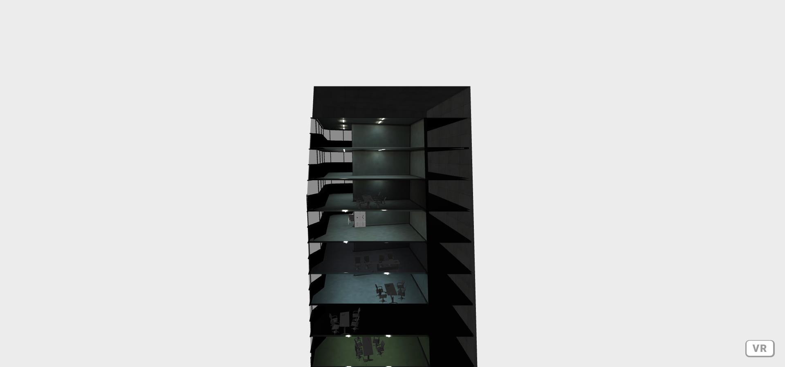

# A-Frame Cross-Section Component


### **Description / Rationale**
This is a small A-Frame component, which allows to create cross-sections/dissections and show what is inside of a 3D model/object. It can be used in showing the inner of an architectural model or in anotomy classes. 

### **Instructions**
To enable cross-section component: 
1. Attach it to the head of your html file, for example: 
```
<script src="cross-section-component.js"></script>
```
2. Attach attribute of "cross-section" to the model you want to do the cross-section. Also, attach a class, for making it clickable, for example: 
```
<a-entity class="clickable" cross-section gltf-model="#room" rotation="0 180 0" position="0 -1.5 -3" scale="0.02 0.02 0.02">
``` 

If necessary define the parameters of the attribute. It has two parameters: distance - a distance from camera to object; animationTime: time for animation of the cross-section. For example:
``` 
cross-section="distance: 3; animationTime: 4000" 
```
3. Make sure to add click event:
<b>For mouse:</b> 
```
<a-entity cursor="rayOrigin: mouse" raycaster="objects: .clickable;"></a-entity>
```
<b>For VR controllers:</b>
```
<a-entity class="controller" laser-controls="hand: left" raycaster="objects: .clickable;" line="color: #000000"></a-entity>
<a-entity class="controller" laser-controls="hand: right" raycaster="objects: .clickable;" line="color: #000000"></a-entity>
``` 

### **Tech Stack**
The project is powered by AFrame.

### **Credits**
The 3D model of the building was created by <b>Nikitos & 3130</b> and can be found <a href="https://sketchfab.com/3d-models/office-building-af9782245c134c21ae0c8df7f57077e6">here</a>. 


### **Demo**
To see the application at work: [Demo application](https://cross-section-component.glitch.me/)
